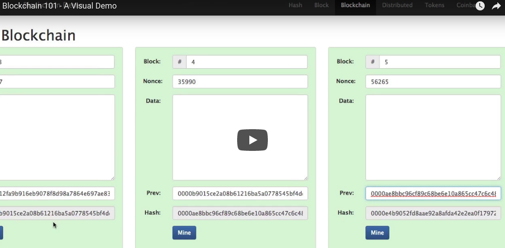

# Ethereum Solidity Development


- [Awesome blockchain demo](https://anders.com/blockchain/)

<a href="https://www.youtube.com/watch?v=_160oMzblY8&feature=" target="_blank"></a>

- [Ethereum Yellow Paper](http://gavwood.com/Paper.pdf)
- [Merkle Patricia Trie Specification (also Merkle Patricia Tree)](https://github.com/ethereum/wiki/wiki/Patricia-Tree)
- [Understanding the ethereum trie](https://easythereentropy.wordpress.com/2014/06/04/understanding-the-ethereum-trie/)


## Install packages (Linux)

- [NodeJs](https://nodejs.org/en/download/package-manager/)
    ```
    sudo dnf install nodejs
    ```
- Ethereum. [Geth](https://github.com/ethereum/go-ethereum)
    + Install Ethereum in fedora (https://copr.fedorainfracloud.org/coprs/jonny/ethereum/)
    ```
    sudo dnf copr enable jonny/ethereum
    sudo dnf install go-ethereum
    /usr/bin/geth
    ```
- testrpc
    + testrpc can emulate Ethereum node for development purposes
    + testrpc is a easy way to test the application (this is just an emulator)
    + testrpc is not a full implementation of the Ethereum node that deployed in the public network
    + Need to test with a full Ethereum node before deploy in to main Ethereum network 
    ```
    npm install -g ethereumjs-testrpc
    ```
- Turffle
    + Install
    ```
    sudo npm install -g truffle
    ```


## Install private Ethereum instance with geth 

- create the folder that will host the database and the accounts 
    ```
    mkdir -p ethchain/private
    ```

- Choose a network identifier for our private network. 
    + Pricate network identifier must be completely different from the public network identifiers
    + Main chain of Ethereum has the network identifier = 1 
    + 
- 