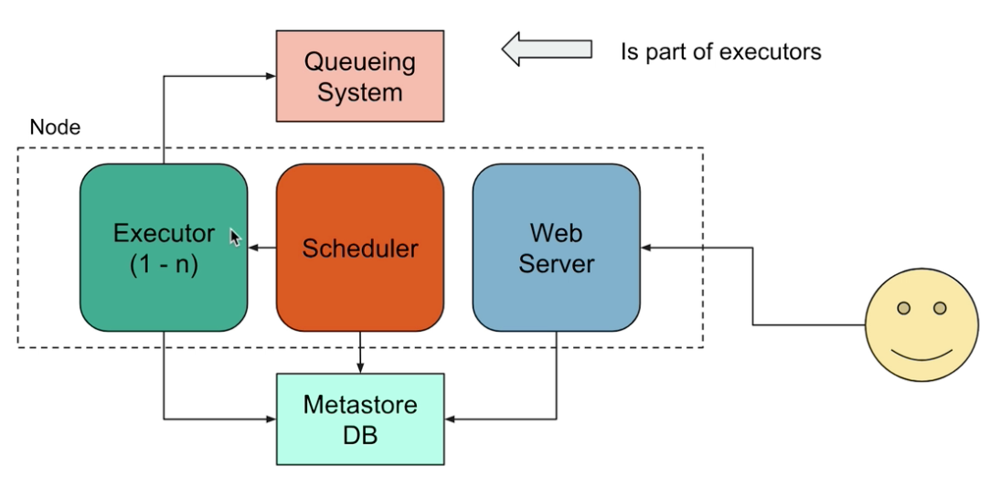
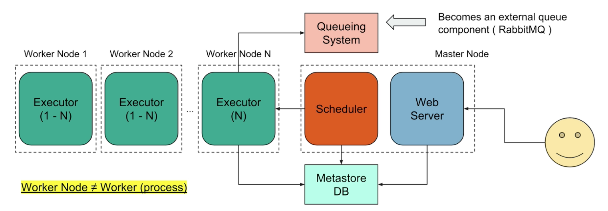

# How to use Airflow 

### Keywords:
- DAG:
  - A directed acyclic graph that represent data pipeline
- Operator:
  - Describe a single task in the data pipeline 
- Task:
  - An instance of a operator 
- TaskInstance:
  - Representation a specific run of a task = DAG + TASK + POINT IN TIME
- Workflow:
  - Combination of all above 
- Scheduler:
  - Responsible for scheduling your jobs
- Executor:
  - Message queuing process tightly bound to the Scheduler and dtermines the worker processes that actually execute each task. 
- Workers:
  - Processes taht execute the tasks, determined by the executor
- Metadatabase:
  - A database where allt he metadata related to your jobs are stored.

### Airflow in a single Node 

### Airflow in a multinodes 

### How Workd Gets Done 

1. The schedulear reads the DAG folder
    - DAG folder contain all the python files that describe tasks
2. DAG is parsed by a process to create a DagRun based on the scheduling parameters of your DAG.
3. A TaskINstance is indtatiated for each Task that needs to be executed and flagged to "Scheduled" in the metadata database.
4. Scheduler get the info from database that are flagged as "shecduled" and change to "Queued" and sends them to the executors to be executed. 
5. Executors pull out the Tasks from the queue and change the state to "running" and workikers start executing the taskinstances. 
6. When task is finishedm the Executor changes the state of the task to final state.
 
#### Important Properties of a DAG
- `dag_id`: unique identifier of a dag
- `description`: the description of the dag
- `start_date`: what date the dag should start. At the beginning dag will run starting the start date. For example if you have the start date setup 3 years ago, thats the date it will use to start running the dag.
- `schedule_interval`: Define how often the dag rum starting from start_date
- `default_args`: a dir contain parameters that will apply to all operators and to the task
- `catchup`: perform scheduler catchup (True by default)

