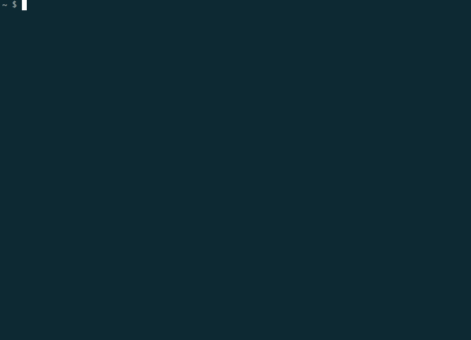

AWS Command Line
====================
- AWS CLI is a case sensitive framework 

# Configure

### - Set up initial configuration
```
$ aws configure
$ AWS Access Key ID [****************WYFA]: XXXXXXXXXXXXXXXXXXXXXXXXX
$ AWS Secret Access Key [****************W5F2]: XXXXXXXXXXXXXXXXXXXXXXXXXXXXX
$ Default region name [us-east-1]:
$ Default output format [None]:
```
- aws credential are stored in ~/.aws/
- Output formats are: JSON (default), text, table

### - Change the default output format
```
$aws ec2 describe-instances --output table | text | json
```

### - Getting Help 
```
$ aws --version
$ aws aim help
```

### - Set up Autocomplete
http://docs.aws.amazon.com/cli/latest/userguide/cli-command-completion.html

- get the shell and aws_completer location
```
$ echo $SHELL
/bin/bash
$ which aws_completer
/staff/ppeiris/anaconda2/envs/tensorflow/bin/aws_completer
```
- set up with the complete command
```
$ complete -C '/staff/ppeiris/anaconda2/envs/tensorflow/bin/aws_completer' aws
```
Now you can double tap TAB key to autocomplete aws commands 

### - Dry Run

Dry run allow to run the command line options without really making any real effect. This wont give us any output, it will give a message saying the command would have success or fail. 

```
$ aws ec2 describe-regions --dry-run
```
Output 
```
An error occurred (DryRunOperation) when calling the DescribeRegions operation: Request would have succeeded, but DryRun flag is set.
```


# Process Data

### - Filters Option

You can use filters to limit the output of a command. This filtering happen on the server side.

```
$ aws ec2 describe-instances --filter Name=instance-type,Values=t2.micro
```
### - Query Option

You can also use the query option to limi the results. This happen on the client side (i.e: this is very similar to grep option)

```
$ aws ec2 describe-regions --query 'Regions[?RegionName==`us-west-1`]'
```
Output 
```json
[
    {
        "RegionName": "us-west-1",
        "Endpoint": "ec2.us-west-1.amazonaws.com"
    }
]
```

## Process JSON data using Jamespath query language

JAMESpath is a query language for JSON data (http://jmespath.org/). 

Install using conda

```
conda install -c conda-forge jmespath
```

Install JAMESpath terminal 

https://github.com/jmespath/jmespath.terminal
```
pip install jmespath-terminal
```

### - How to use jpterm 
Following command get the list of reagions in JSON format and open up the jamespath terminal to interact with the data. 
```
aws ec2 describe-reagions | jpterm
```




*image credit to https://github.com/jmespath/jmespath.terminal*

- Exit using **Ctr+C**
- You can build comples queries in jamespath terminal and then use then with **Query** option directly to use in programatic way. 

# CLI Commands for AWS S3

### - Create a bucket (make bucket - mb)

- create a bucket call *'unique-name-of-the-bucket'*.
- More help using - **aws s3 mb help**

```
$ aws s3 mb s3://unique-name-of-the-bucket
```
### - Copy files to a bucket (copy - cp)

- Copy the file call FILE_NAME to the bucket and a directly within in call *dir-name*
- More help using - **aws s3 cp help**
```
$ aws s3 cp FILE_NAME s3://unique-name-of-the-bucket/dir-name/
```

### - List all the buskets 

- This command will display all the buskets that are in the account. 

```
$ aws s3 ls
```

### - List all the files within a bucket 

```
aws s3 ls s3://unique-name-of-the-bucket
```

### - Move all the files from S3 to local dir (mv --recursive)

- This move all the files from S3 bucket to local folder (remove from the S3)

```
$ aws s3 mv s3://unique-name-of-the-bucket . --recursive
```

### - Move files from local dir to S3

- exclude and include flags can be use to pick which files need to be move

```
$ aws s3 mv . s3://unique-name-of-the-bucket --recursive --exclude '*' --include '*.txt'
```

### - Sync local filed with S3 (|S3 to local | S3 to S3)
- This will sync local files to S3 
    - This update the files that nees updates 
    - New files get created in S3

```
$ aws s3 sync . s3://unique-name-of-the-bucket
```

### - Sync files with delete option 
- This flag delete the files that are deleted from the local folder 

```
$ aws s3 sync . s3://unique-name-of-the-bucket --delete
```

### - Upload a file with public read permission (acl)

```
$ aws s3 cp FILE_NAME s3://unique-name-of-the-bucket --acl public-read
```

### - Delete files from S3 (rb)

- Delete files from S3

```
$ aws s3 rb FILE_NAME s3://unique-name-of-the-bucket 
```

- Delete all the files from S3 & delete the bucket 

```
$ aws s3 rb s3://unique-name-of-the-bucket --force
```

# Update aws cli to version 2 in mac

```
$ curl "https://awscli.amazonaws.com/AWSCLIV2.pkg" -o "AWSCLIV2.pkg"
$ sudo installer -pkg AWSCLIV2.pkg -target /
```


