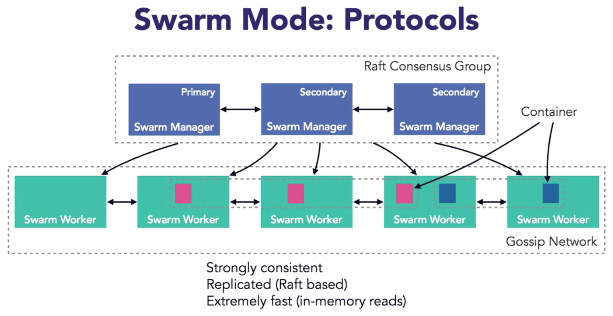
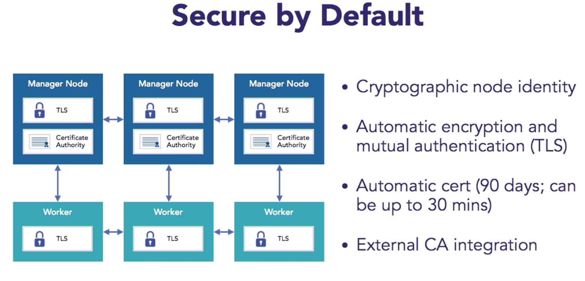
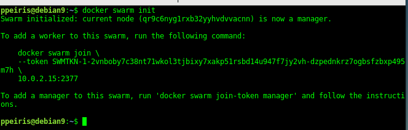

# Docker Compose

- Docker Compose define and run multicontainer applications
- Single command to manage all services
- Condfiguration deinfed in one or more files
    - `docker-compose.yml` This is the default file name
    - `docker-compose.override.yml` 
        If this file exists, this will overide the `docker-compose.yml` file


# Docker Compose File

```bash 
version '3'
services:
    web:
        image:  ubuntu:14:04
        volumes:
            - ~/SOME_LOCAL_DIR:/PATH/TO/DIR/IN/CONTAINER
        ports:
            - 8080:8080 # Ports mapping Host to container 
```

# Docker compose commands 

```bash 
$ docker-compose up -d # Start docker and deattach
$ docker-compose ps # list all the docker containers
$ docker-compose logs -f # look at the logs 
$ docker-compose down # shutdown the services
$ docker-compose -p namespace_name up -d # create services with namespace `namespace_name`
```

# Multicontainer applications with Docker Compose

- Two containers and one depend on other 

```bash
version '3'
services:
    web: # web service 
        image:  ubuntu:14:04
        enviornment:
            - ENV_NMAE=db # some env variable name
        volumes:
            - ~/SOME_LOCAL_DIR:/PATH/TO/DIR/IN/CONTAINER
        ports:
            - 8080:8080 # Ports mapping Host to container 
        depends_on:
            - db # web is depends on db, web service will start after the db service
    db: # database service
        image: IMAGE_NAME
        ports:
            - 8091:8091 # mapping ports 
```

# Docker Compose Override 


- File name is `Dcoker-compose.override.yml`
- `Dcoker-compose.override.yml` override contents in `Dcoker-compose.yml` file

Example: 

 - Using Dcoker-compose.override.yml file, override the ports 
 - Final services will have ports that is defined in override file

**Dcoker-compose.yml**
```yaml 
# Dcoker-compose.yml
version '3'
services:
    web:
        image:  ubuntu:14:04
        volumes:
            - ~/SOME_LOCAL_DIR:/PATH/TO/DIR/IN/CONTAINER
        ports:
            - 8080:8080 # Ports mapping Host to container 
```

**Dcoker-compose.override.yml**
```yaml 
# Dcoker-compose.override.yml
version '3'
services:
    web:
       - 80:8080 # Ports mapping Host to container 
```


# Use multiple Docker Compose Files

- You can have multiple files nested (order matters)


```bash 
$ docker-compose \
    -f docker-compose.yml \ # Starting compose file
    -f docker-compose.another.yml # Another compose file that overide/extend previous file
    up -d
```


**Dcoker-compose.yml**

```yaml 
# Dcoker-compose.yml
version '3'
services:
    web:
        image:  ubuntu:14:04
        volumes:
            - ~/SOME_LOCAL_DIR:/PATH/TO/DIR/IN/CONTAINER
        ports:
            - 8080:8080 # Ports mapping Host to container 
```

**Dcoker-compose.another.yml**
```yaml 
# Dcoker-compose.another.yml
version '3'
services:
    web:
        ports:
            - 80:8080 # override port from Dcoker-compose.yml
    db: 
        image: NEW_IMAGE # Override the image form Dcoker-compose.yml
```


# Use Custom Dockerfiles in docker-compose

```yaml
version: "3.5"
services:
    # Building API server that is running php7.3 + apache web server
    web:
        container_name: web
        # Build using custom Dockerfile
        build:
          context: . # Path to custom Dockerfile
          dockerfile: Dockerfile_WebApp # Custom Dockerfile name
```


# Swarm Mode

- Natively managing a cluster of Docker engines called a swarm 
- Docker CLI to crate a swarm, deploy apps, and manage a swarm 
- No single point of failure (SPOF)
- Declarative state model 
- Self-organizing and self-healing 
- Service discovery, load balancing, and scaling 
- Rolling updaes 


## Swarm Managers and Swarm Workers



## Security 



## How to start a Swarm

- This will start with single node swarm (still has the single point of failure)

```bash 
$ docker swarm init 
```




```
$ docker info # this will show swarm active 
```


## How to stop a Swarm 

```
$ docker swarm leave -f
```


- Continue to learn https://www.linkedin.com/learning/docker-for-java-developers/create-a-multinode-swarm-mode-cluster-using-docker-machine
