# Introduction to docker

## Docker Image: 

- Image contain everything your service need to run (this is like a class in a programing language)
- Docker is based on Open standards (run on all the major linux standards)

## Docker Container: 

- Running instance of a Docker Image (this is like an instance of a class)
- Containers share the host operating systems kernel and resouce isolation is done using **_cgroups_** 
- Boot really fast compare to Virtual Machines (VMs)
- Does not take any disk space (this is running on the memory)
- Containers are secure since they are isolated

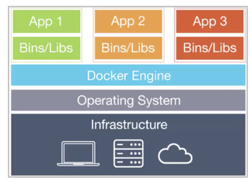


## Benifits of using Docker 

- Application is backed into a image and can start within miliseconds
- New developers can star the env really quickly instead of installing and configuring enviornments
- Can experiment with new env and languages quickly 
- Since everything is packaged, corss env consistancy guranteeds
- Docker is a framework
- Docker images can be distributed publically
    - https://hub.docker.com/ contain many publically shared docker images 


## Download and run a docker image from docker hub (https://hub.docker.com/)

### busybox example:

- Docker can download and run pubilc images. The following command download the busybox docker latest image and run the echo command. 
    - ```--rm``` flag remove the docker container after it ran

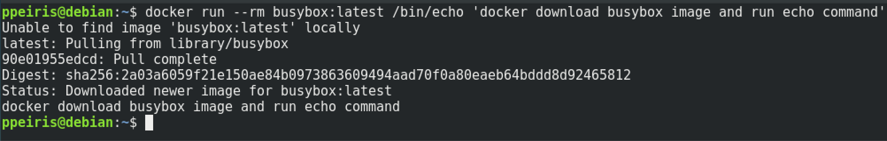

- Display all locally installed docker images 

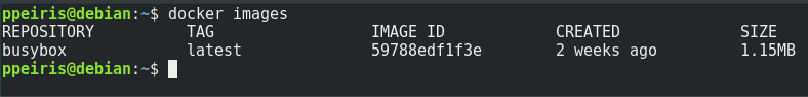

- Dispaly all the Docker Containers 
    - when run without the ```--rm``` flag, the container stay in the memory 

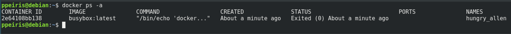

- Manually remove the Docker Contianers from the memory
    - Use the containerID to remove from the memmory

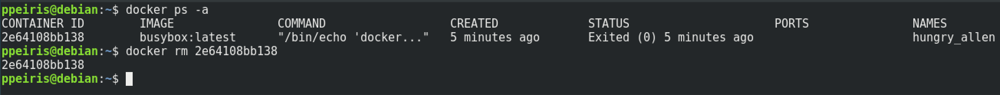


##  Take a look at inside of a docker image
Take a look at the busybox docker image.

- ```-it``` flag: interactively 

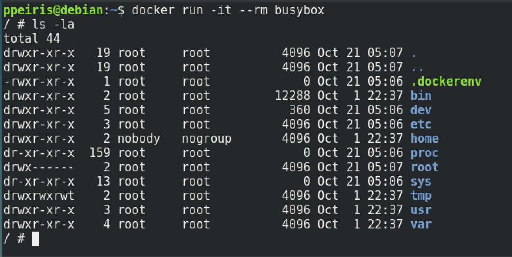

- Remove docker images 
""
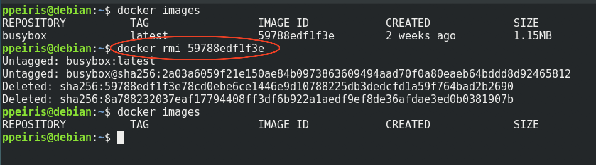

## Create Docker image form a container 

Lets run a Docker image. This time lets use the ubuntu docker image. This will download the docker ubuntu image and run it.

```
$ docker run -ti --rm ununtu
```

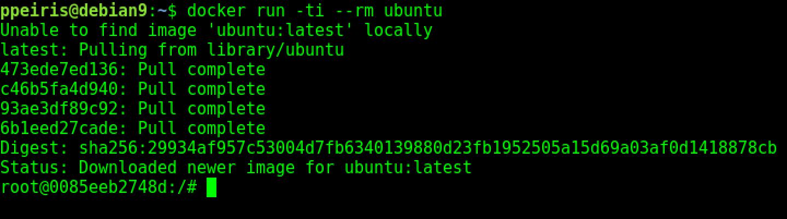

    - Get the docker container id using ```docker ps -a ``` command
    - Create a new docker image from the container id


```
$ docker commit CONTAINER_ID NEW_IMAGE_NAME
```


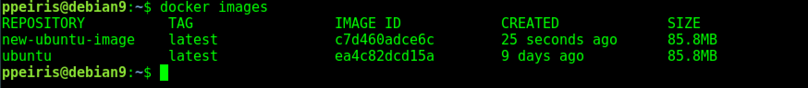

    - Run the new docker image

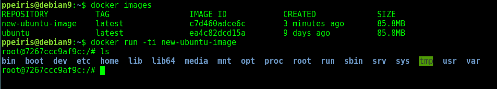


## Complete Docker Flow 

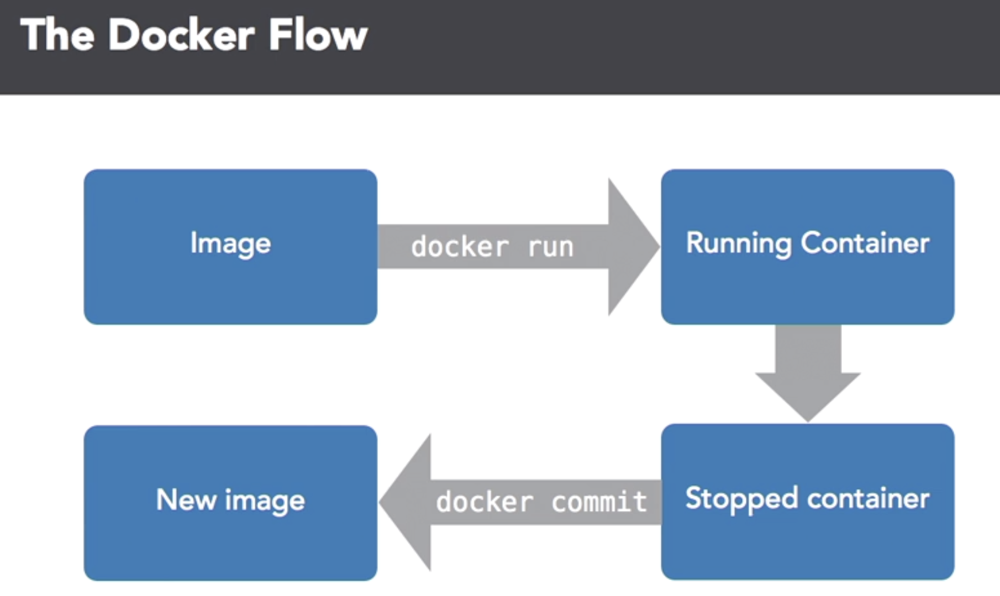


## Run couple of commands and exit

Execute couple of commands and exit from the container. The container will be live only during the commands execution. These commands will run one after the other. 

```
$ docker run -ti ununtu bash -c "sleep 3; echo all done"
```

## Docker run with Detach and Attached 

### Detach
Docker run with with detach mode. 

```
$ docker run -d -ti ubuntu bash
```

### Attach
Attache a docker container that start with -d option

```
$ docker attach CONTAINER_ID
```

#### Exit from attached container 

Deattach with Ctr-p Ctr-q


#### Attach another process to a existing container 
This method is good for debugging and DB admin stuff (can not add additional volumnes or ports)

In this example I am adding bash process
```
$ docker exec -ti a34f7141498f bash
```


## Looking at Container outputs

Docker log all the outputs. Access these logs using 

```
$ docker logs CONTAINER_ID
```
**Make sure not to write tons of data to docker logs, these logs can get really large over time**

## Remove and Kill Containers 

Remove running containers form the memory 
```
$ docker kill CONTAINER_NAME OR CONTAINER_ID
```
delete containers
```
$ docker rm CONTAINER_NAME OR CONTAINER_ID
```

# Resource Constraints

## Memory limits 
We can limit how much memory a container can use
```
$ docker run --memory MAX-ALLOED-MEMORY IMAGE_ID
$ docker run --memory 5m IMAGE_ID 
```

## CUP limits 
Limit number of CPUs to share 
```
$ docker run --cpu-shares 
```

## Put hard limits on how much CPU time a container can use 
```
$ docker run --cpu-quota 
```


# Dockerfile 
## Write a Docker file 

TODO

## Build a Docker Image 

Build a docker image form a docker file 

```
$ Docker build -t NEW_IMAGE_NAME /path/to/Dockerfile
```

# Get ZendExpressive Up and running using Docker

## Create a Docker image including php 7.3

Create a Dockerfile and add the following. 

```
FROM php:7.3.3-cli

MAINTAINER Prabath Peiris

# Update the system
RUN apt-get update
# Install dependencies
RUN apt-get install -y zip unzip curl git
# Install Composer
RUN php -r "copy('https://getcomposer.org/installer', 'composer-setup.php');"
RUN php composer-setup.php --install-dir=/usr/bin --filename=composer
RUN php -r "unlink('composer-setup.php');"
```

## Build the Docker Image from Dockerfile 

Docker image name set to `zendexpressive`

Dockerfile is in the local dir

```
$ Docker build -t zendexpressive .
```

## Install ZendExpressive skeleton application

- Mount a base volume to `/opt`
- define the docker image 

```
$ docker run --rm -it \
        -v /base/path:/opt \
        zendexpressive:latest \
        composer create-project zendframework/zend-expressive-skeleton /opt/api
```

## Run the php webserver 
- Map the ports (ssh port forwarding localhost:9992 -> 0.0.0.0:9992

```
docker run --rm -it \
        -p 9992:9992 \
        -v /base/path:/opt \
        zendexpressive:latest \
        php -S 0.0.0.0:9992 -t /opt/api/public
```


