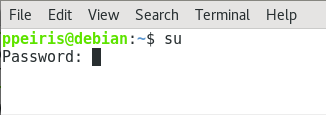
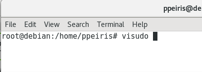
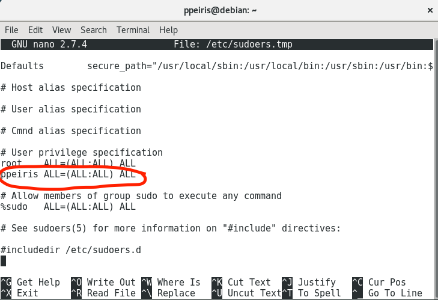

# Install Docker 

Docker installation instructions in Debian 

### Add a user to a sudo in Debian 

- Become root

    

- Edit ```/etc/sudoers``` file

    

- Add the user under ```User Privilege Specification```

    

### Install Linux headers

```
sudo apt-get install linux-headers-$(uname -r)
sudo apt-get update && sudo apt-get upgrade
```

### Install Docker 

- Install required packages: 
    
    ```
    $ sudo apt-get install libapparmor1 aufs-tools ca-certificates
    ```

- Download the docker install package from  http://apt.dockerproject.org/repo/pool/main/d/

- Install Docker

    ```
    ppeiris@debian:~$ sudo dpkg -i docker-engine_17.05.0~ce-0~debian-stretch_amd64.deb
    ```

- Test the installation

    ```
    $ docker --version 
    ```

- Add the user to docker group in order to use docker commands without using sudo 

    ```
    $ sudo usermod -aG docker ppeiris
    ```


### Install Docker Composer 

- Download the Docker composer file 

    ```
    $ wget https://github.com/docker/compose/releases/download/1.22.0/docker-compose-`uname -s`-`uname -m`
    ```

- Move the file in to system path 

    ```
    $ sudo mv docker-compose-Linux-x86_64 /usr/local/bin/docker-compose
    ```

- Make the file executable 

    ```
    $ sudo chmod +x /usr/local/bin/docker-compose
    ```

- Test the installation 
    ```
    $ docker-compose --version
    ```


