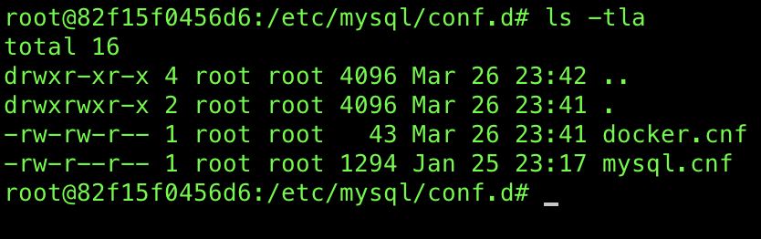

# Install mysql using docker 

### Create a docker-compose.yml file 
```bash
version: '3'
services:
  mysql:
    image: mysql
    ports:
     - "3306:3306"
    environment:
      MYSQL_ROOT_PASSWORD: "root"
      MYSQL_DATABASE: "SOME_DB_NAME"
      MYSQL_USER: "USERNAME"
      MYSQL_PASSWORD: "PASSWORD"
    volumes:
     - mysqllocation:/var/lib/mysql
volumes:
  mysqllocation:
    driver: "local"
```

## Docker compose 

```bash
$ docker-compose up -d 
```
***-d deattach the terminal from the process***


## Connect to the container and run bsh shell

```bash
$ docker exec -it CONTAINER_ID bash 
```

Go to the /etc/myql directory 


**Everything is in the `cond.d` directry automatically get loaded**

Go to the /etc/mysq/conf.d




### All the files (*.cnf) in the conf.d directory get loaded. 
 
 - Everything is in the `docker.cnf` get loaded. 

 `docker.conf` file
```bash
[mysqld]
skip-host-cache
skip-name-resolve
```
 - `mysql.cnf` file does not have much to get loaded, it has a `[mysql]` section as a placeholder 

#### If we need to load any other config, just add another `.cnf` file into `conf.d` directory

## Enable query log
- Query-log logs all the queries that run against the database 
- Add a conf file (query-log.cnf) into /etc/mysq/conf.d directory. 

```bash
[mysqld]
general-log=On
general-log-file=/var/log/mysql/query.log
```

- We can map all the logs and conf.d dir to host machine dir so we can overide the container files. 

#### Final docker-compose file

```bash 
version: '3'
services:
  mysql_colorectal_predictions:
    container_name: CONTAINER_NAME
    #image: mysql
    image: keladb
    ports:
     - "3306:3306"
    environment:
      MYSQL_ROOT_PASSWORD: "root"
      MYSQL_DATABASE: "DB_NAME"
      MYSQL_USER: "USERNAME"
      MYSQL_PASSWORD: "USERPASS"
    volumes:
       # Map docker mysql lib directory to host machine dir to preserve sql database
     - VOLUME_NAME:/var/lib/mysql
       # Log files map to local file
     - ./logs:/var/log/mysql
       # Map docker mysql conf.d dir to host machine dir
       # This allow to preserve config files even after we delete the docker containers
     - ./conf.d:/etc/mysql/conf.d
volumes:
  VOLUME_NAME:
    driver: "local"
```


## mysqldump (Backup database)

Backup the database using mysqldump 

```
$ docker exec CONTAINER_NAME mysqldump -u root -proot DB_NAME  > backup.sql
```

### We can put the username and password to a config

- Create a config file (`mysqldump.cnf`) in `conf.d` dir 

```bash
[mysqldump]
user=root
password=root_password
```

- restart the docker container 

```bash
$ docker restart CONTAINER_NAME
```

- use mysqdump without username and password 

```bash
docker exec CONTAINER_NAME mysqldump DB_NAME  > backup.sql
```

## Restore Database 

```bash
$ cat backup.sql | docker exec -i CONTAINER /usr/bin/mysql -u root --password=root DATABASE
```

