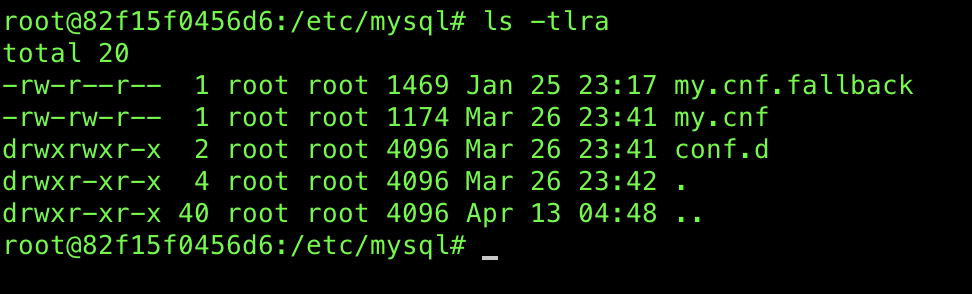

# Install mysql using docker 

### Create a docker-compose.yml file 
```
version: '3'
services:
  mysql:
    image: mysql
    ports:
     - "3306:3306"
    environment:
      MYSQL_ROOT_PASSWORD: "root"
      MYSQL_DATABASE: "SOME_DB_NAME"
      MYSQL_USER: "USERNAME"
      MYSQL_PASSWORD: "PASSWORD"
    volumes:
     - mysqllocation:/var/lib/mysql
volumes:
  mysqllocation:
    driver: "local"
```

## Docker composer 

```
$ docker-compose up -d 
```
***-d deattach the terminal from the process***


## Connect to the container and run bsh shell

```
$ docker exec -it CONTAINER_ID bash 
```

Go to the /etc/myql directory 



Everything is in the `cond.d` directry automatically get loaded 


