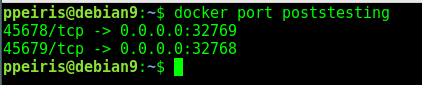
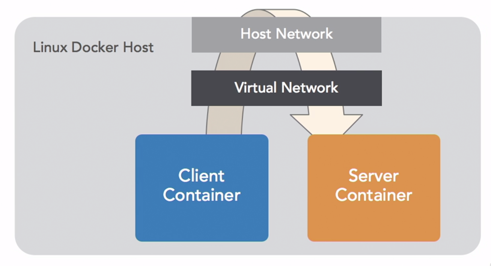
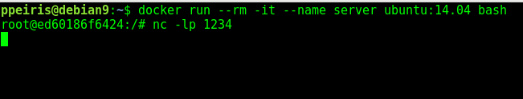
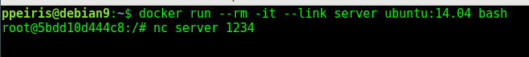
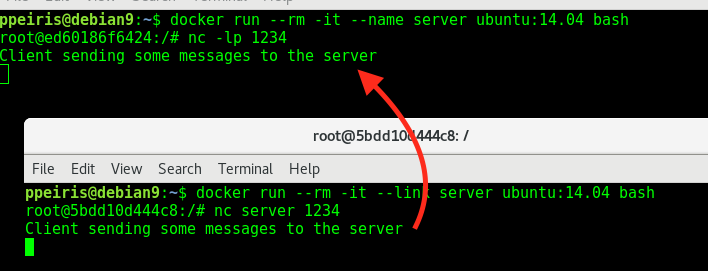
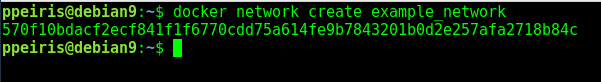
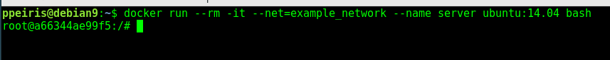
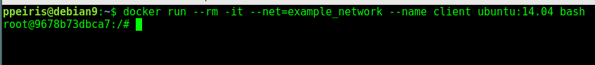
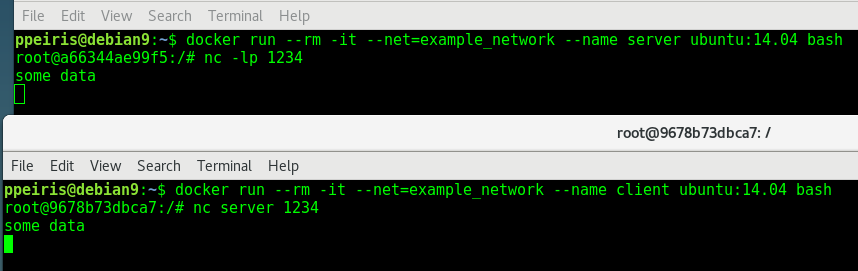

# Docker Networking

- Programs in containers are isolated from the internet by default 
- You can group your containers into "Private" netwroks 

## Private Container Networking 

- This is done by "exposing" ports and "linking" containers 
- Docker helps you find other exposed ports with Component services

## Exposing a Specific Port 

- Explicitly specifies the port inside the container and outside 
- Expose as many ports as you want
- `-p CONTAINER_PORT:HOST_PORT` map the port in docker container to the port in host machine

```bash
$ docker run --rm -it \
    -p 45678:45678 \    # Map Container port 45678 to Host port 45678
    -p 45789:45789 \    # Map Container port 45789 to Host port 45789
    --name CONATAINER_NAME IMAGENAME
```

## Expose Ports Dynamically 

- Run container without specifying the host port 

```bash
$ docker run --rm -it \
    -p 45678 \ # Define only the Container port and host port will get assigned automatically
    -p 45679 \ # Define only the Container port and host port will get assigned automatically
    --name CONATAINER_NAME IMAGENAME
```

- Find out what are the host posts assigned 

```bash 
$ docker port CONATAINER_NAME
```



## Exposing UDP Ports 

```bash
$ docker run -p 1234:1234/udp
```

# Connecting Containers 



## Lets connect two contaners directly wihout getting host involve 

- This is one way communication (for example server --> client)
- Start the server 

```
$ docker run --rm -it --name SERVER_NAME ubuntu:14.04 bash 
```

- Start the client container with linking with server

```
$ docker run --rm -it --link SERVER_NAME ubuntu:14.04 bash 
```

- Now the above two containers are link via ip address of the server. You can take a look at this in the client `/etc/hosts` file

- To test this system, listen to the port 1234 using netcat program `nc`. 
```bash 
$ nc -lp 1234 # netcap listen to port 1234 
```



- Connect to the server port 1234 from the client container



- Now send some messages from Client to the Server via port 1234



### Disadvantages linking containers directly 
- Not a good idea to connect services to DB using this method 
- Links can brake when containers restart 


# Link Contianers Dynamicaly

- Docker has private networks 
- These have built in nameservers that fix the links
- You must **Create** the networks in advance
- `docker network` create `network-name`


## Connecting containers via private network 

- Create a network



- Create a container call `server` having the network defined  



- Create a container call `client` having the same network



- Communicate via network 




### Advantages to docker networks 
- One container can restart and when it come back online, others can simply can connect via the name. 


## IP Address Binding in Your Services 
- Services that listen "locally" by default are only available in the container 
- To allow connections, you need to use the "bind address" "0.0.0.0" inside the container
- You should use Docker to limit access to only the host 
      - `docker run -p 127.0.0.1:1234:1234/tcp`
