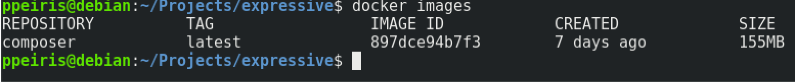

# ZendExpressice App with Docker 

## Use Docker composer to install ZendExpressive
We need to install composer to run all the composer commands including installing ZendExpressive. We also can use the Composer Docker image to do this too. This way we do not have to install Composer.

- Download the Composer Docker image (https://hub.docker.com/_/composer/)

```
$ docker pull composer
```

Check the image 



- Install ZendExpressive at ``` /home/ppeiris/Projects ```
    - ```--user``` this flag takes the uid (user id) and gid (group id). All the file and dirs are created under these ids  

```
$ docker run -it --rm  \
    --user "$(id -u):$(id -g)" \
    -v "$PWD":/home/ppeiris/Projects \
    -w /home/ppeiris/Projects \ 
    composer create-project zendframework/zend-expressive-skeleton expressive
```

- create ```Dockerfile``` and edit it 
    - Dockerfile is resepie to create docker image 
    - It can contain serise of commands 
    - 


```
FROM php:7.3.3-cli

MAINTAINER Prabath Peiris

RUN apt-get update
RUN apt-get install -y zip unzip curl git
RUN php -r "copy('https://getcomposer.org/installer', 'composer-setup.php');"
RUN php composer-setup.php --install-dir=/usr/bin --filename=composer
RUN php -r "unlink('composer-setup.php');"
```
