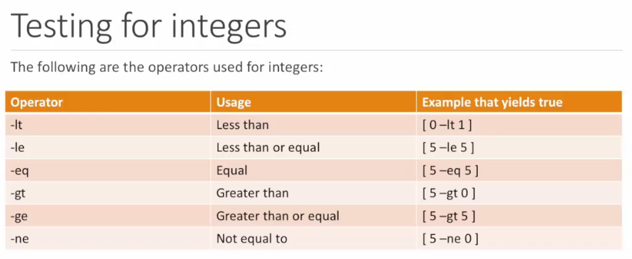
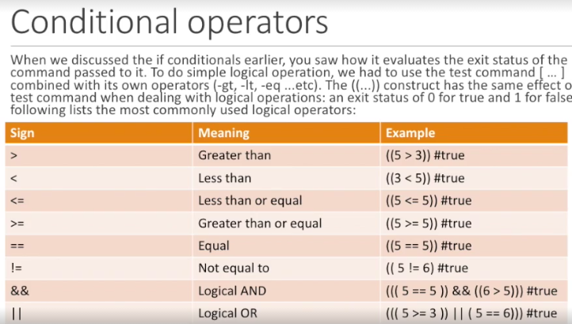

# Shell Scripts

-Detail HELP (http://mywiki.wooledge.org/BashFAQ)

```
type -t command # this will give you what kind of command is this
type -a command # this will give you all types of the given command
```

## Special Variables
```
$ ./ScriptName arg1 arg2 arg3
```
```
echo $0     # this will print the script name (argument zero)
echo $1     # this will print the first argument given when executing the shell script
echo $*      # this will print all the arguments given when  executing the script
echo $@    # this will print all the argument given when executing the script
echo $#    # his will print the number of argument that given to the script when it executed
echo $?    # Exit numerical value of the last command ran on the shell
```

## Variables
```
myVar = "this is a variable"
echo $myVar         # this will print the variable. this is the informal way to use the variable
echo ${myVar}      # this is the formal way to access a variable value
```
```
echo ${varname:- default value}     # if var name is not defined it will print the default value instead null
echo ${varname:= default value}    # if var name is not defined it will define the varname to default value
echo ${varname:? message}            # if the varname not defined, print the message and exit the script with error
echo ${varname:+ message}            # if varname defined it will print the message (not the varname), else it will print a null
echo ${varname:offset:length}        # only print the part of the varname, ex: $(varname:3:4)
echo ${@:2:3}                                       # it will print the second, third args
echo ${#varname}                               # Number of chars in the variable
```

## Patterns in variables
```
varname="home/dirname/something/dirname/Documents"
echo ${varname#pattern} # start from the beginning, delete till the fist occurrence
echo ${varname#*/dirname} # print /something/dirname/Documents
```
```
echo ${varname##pattern} # start from the beginning, delete till the last occurrence
echo ${varname##*/dirname} # print /Documents
```
```
echo ${varname%pattern} # start from the end, delete till the first occurrence
echo ${varname%%pattern} # start from the end, delete till the last occurrence
```

## Single quote and Double quote
```
myvar="Prabath"
echo 'my name is $myvar' # this will output 'my name is $myvar'
echo "my name is $myvar" # this will output 'my name is Prabath'
```

## Variables and function
```
myVar = 'this is a global variable'
function myfunc() {
     local mylocalvar = 'this is a local variable to the function'
     local myVar = 'this will overwrite the global variable within the function'
     echo $1 # this will be the first function argument NOT the script argument
}
```

## IFS Variable  (Internal Field Separator)

```
IFS=,
echo "$*" # this will print arg1,arg2,arg3
echo "$@" # this will print arg1 arg2 arg3
echo "$#" # this will print 3
```

### - Set the IFS to new line
```
IFS=$'\n'
```

## Command output to variable

```
files=$(ls -l) # assign the output of ls -l to files variable
file_contents=$(<filename.txt) # this will load the file contents to file_content variable
```

## IF condition
```
if condition; then
     echo 'ok'
else
     echo 'no'
fi
```
```
[ -n "test" ]
[ var1 == var2 ] # if this true exit status is 0, else it will 1
```
```
[ -n $var ] # check if the var is not null
```
```
if [[ -n "Hello" ]]; then
     echo "Not Null"
fi
```
```
[ -z "test ]
# [ -z $var ] check if the var is null
if [[ -z "Hello" ]]; then
     echo "Not Null"
fi
```

## Negation


#### ! sign negate the result of [ -n "test"]
```
if ! [[ -n "test"]]; then
     echo "ok"
fi
```

```
[ -s $filename ]
[ -s $filename ] # filename exists and its not empty

exits with a non-zero status
set -e
```
```
-e  Exit immediately if a command exits with a non-zero status
```

- http://mywiki.wooledge.org/BashFAQ/105
- http://stackoverflow.com/questions/19622198/what-does-set-e-mean-in-a-bash-script

## Arrays
- http://tldp.org/LDP/Bash-Beginners-Guide/html/sect_10_02.html







## Some command line tricks 

### list all the unique file names (only by the starting portion that separate by -)
```
ls -1 | cut -f1 -d\- | sort | uniq
```

### list unique names (part of the name)
```
ls | xargs -0 | cut -d'-' -f-1 | uniq
```

### Find and replace 

```
grep -rl subsestion . | xargs sed -i 's/subsestion/subsection/g'

```

